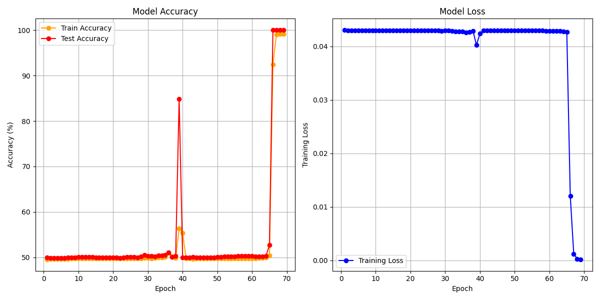

# Gated-Recurrent-Unit-CPP
This project aims at programming a Gated Recurrent Unit (GRU) from scratch in C++. Later on, it will be useful to do NLP

### Model
- **Model:** Gated Recurrent Unit,
- **Optimizer:** Adam optimizer,
- **Regularization methods:** No regularization method.

## Introduction
The aim of this project was to create a Gated Recurrent Unit from scratch, in C++. Using Adam optimizer to update weight, we can get a perfect accuracy on predicting the binary nature of the sum of several binary numbers (up to 1000 in 50 epochs). The underlying aim of the project is to get a grasp on how this type of architecture works, in order to later on use it for Natural Language Processing (NLP). Indeed, GRU's accuracy can be compared to LSTM's, therefore I chose GRU architecture since it is is simpler to implement. The final goal would be to handle words by adding an embedding layer.

### Why C++ ?
Firstly, I basically chose C++ because I'm much more familiar with it than Python. But more generally, the main reason to use C++ here was to fully exploit the capabilities of pointers and adresses, for performance and to exercise low-level memory control (matrices, bias-as-last-row tricks, manual BLAS-like loops).

## Methodology
Firstly, I created the GRU class, which uses six different weights. Wx for the input weights, Ux for the hidden layer weights, and Wout for the output weight. These are used inside the forward method to generate the output, and their gradient derivatives are calculated through the backpropagation method. The weights are then updated when the Scope is called, using Adam optimizer. A Dataset method creates the Dataset, while the TrainerClassifier class gathers the training and validation process. For details, please see the bottom of this Readme.

### Dataset

This dataset consists in synthetic data for a binary parity problem. Each example is a sequence of seq_len bits (0/1). At each time step t, the target is the cumulative parity sum(bits[0..t]) mod 2. The loader generates batches of size batch_size. The dataset is produced with random generation to ensure reproducibility.


### Why this GRU design is appropriate

- GRU gates allow the model to keep long-term information with fewer parameters than LSTM, which is a good fit for the parity task and many sequence problems.
- The chosen bias-last-row trick simplifies multiplication loops and is friendly to manual memory optimisations.

### Hyperparameters (example)

We have two slightly different architectures. A many-to-many, and a many-to-one. Since the many-to-many is the one that gives the best results (since a RNN is good at predicting the next step), we are going to focus on this one.
- I used a learning rate of $$5 \cdot 10^{-3}$$.
- The inputs and outputs are vectors with dimension $$1$$.
- The sequence length is $$1000$$.
- The weights of the hidden layers has a dimension of $$16$$.
- In Adam optimizer, $$\beta_m = 0.9$$ and $$\beta_v = 0.999$$.
- I used batches of **16 bits**, and used it on the whole dataset.

## Results

### Observations
- Results on the binary nature of the sum of binary numbers database. When ran into the whole training database, the model gives the following results:


Here, values are plotted after each epochs. The early stopper stopped 3 epochs before the end. We can see the training accuracy, validation accuracy and training loss for each epochs.

### Discussion
- **Next steps:**
  - The next move would be to implement max-pooling layers and/or batch normalization, to lengthen the max sequence length we can have. It would help to improve training stability.
  - I didn't implement flooding. It could improve the model.
  - For performance, we could also try alternative optimizers like RMSprop, AdamW or Nadam. We could also experiment by implementing Dropout.

---

## How to Use

- Run the ```GRU.bat``` file. It closes when it finished training (accuracy 100 for 3 epochs).
- To plot training metrics, run ```plot.py``` file from the project root.

To change hyperparameters, you must recompile everything for now. The command to compile is: ```mingw32-make -f MakeFile```.


## Requirements

- Mingw32 compiler version ```gcc-14.2.0-mingw-w64ucrt-12.0.0-r2```.
- Python 3.x .

---

## Repository Structure

```plaintext

NeuralNetwork/
├── executable/
│   ├── main.exe
│   ├── model_weights.txt
│   └── xxx.dll
├── img/
│   └── latest_output.png
├── Neural_Network/
│   ├── Classifier/
│   │   ├── Scope.cpp
│   │   ├── Scope.hpp
│   │   ├── TrainerClassifier.cpp
│   │   └── TrainerClassifier.hpp
│   ├── Dataset/
│   │   └── Dataset.hpp
│   ├── GRU/
│   │   ├── GRU.cpp
│   │   ├── GRU.hpp
│   ├── Utilities/
│   │   ├── functions.cpp
│   │   ├── functions.hpp
│   │   ├── Matrix.cpp
│   │   └── Matrix.hpp
│   ├── main.cpp
│   └── plot.py
├── MakeFile
├── GRU.bat
└── training_data.csv
└── README.md

```

---


## Methodology in detail: how the GRU is implemented

### Equations implemented

For each time step $$t$$, the code computes:

1. $$z_t = \sigma(W_z x_t + U_z h_{t-1} + b_z)$$

2. $$r_t = \sigma(W_r x_t + U_r h_{t-1} + b_r)$$

3. $$\tilde h_t = \tanh(W_h x_t + U_h (r_t \odot h_{t-1}) + b_h)$$

4. $$h_t = (1 - z_t) \odot h_{t-1} + z_t \odot \tilde h_t$$

5. $$y_t = \sigma(h_t W_{out})$$


These are implemented with the following naming in the code:

- ```m_Wz```, ```m_Wr```, ```m_What``` — input-to-gates weights (shape ```(input_dim + 1) x hidden_dim```, bias encoded as last row)
- ```m_Uz```, ```m_Ur```, ```m_Uhat``` — hidden-to-gates weights (shape ```(hidden_dim + 1) x hidden_dim```, bias as last row)
- ```m_Wout``` — hidden-to-output weight (shape ```(hidden_dim) x output_dim```)
- Activations stored per timestep: ```m_aZ[t]``` ($$z$$), ```m_aR[t]``` ($$r$$), ```m_aHat[t]``` ($$\tilde h$$), and hidden states ```m_hiddenStates[t]```. Outputs are ```m_Y[t]```.

### Key implementation details (mapping to your code)

- **Bias trick:** input matrices are multiplied with weight matrices that include bias as their last row. The helper ```MATRIX_OPERATION::addbiases_then_mult(input, weights)``` computes ```input.addBias() * weights``` without materializing the augmented matrix.
- **Backprop weight accumulation:** ```MATRIX_OPERATION::compute_weigths(weights, input, delta)``` performs ```weights += input.addBias().T * delta``` (consistent with bias-last-row storage).
- **Backprop of U* into hidden:** to propagate deltas into previous hidden, the code calls ```m_U*.removeBias().T()``` (removes last bias row then transposes).
- **Derivatives:** derivatives for activation functions are computed from **stored activations**, e.g. ```sigmoid'(s) = s*(1-s)```, ```tanh'(a) = 1 - a^2```. This avoids recomputing nonlinearities on pre-activations and is numerically stable.
- **State initialization:** ```m_hiddenStates[0]``` is explicitly set to zero (safety to avoid garbage memory).
- **Per-timestep storage:** all intermediate deltas are stored in per-time-step vectors (```m_dZ[t]```, ```m_dR[t]```, ```m_dHat[t]```, ```m_dH[t]```, ```m_dY[t]```) so no single variable must persist across loop iterations.

### Forward pass

- For each $$t$$, compute preactivations via ```addbiases_then_mult``` and then apply ```ACTIVATION::sigmoid_activation``` / ```ACTIVATION::tanh_activation```.
- Build $$h_t$$ from gates as shown above.
- Compute output $$y_t = \sigma(h_t * W_{out})$$.

### Backpropagation (BPTT)

- Compute output delta ```m_dY[t] = (y_pred - y_true)``` (binary cross-entropy with sigmoid output).
- Propagate through ```Wout``` to obtain ```dH``` and accumulate contributions from ```m_dH[t+1]``` (temporal dependency).
- Split ```dH``` into branches: contribution to ```aHat``` (via $$z$$), contribution to $$z$$, and contribution to $$r$$; compute parameter gradients using ```compute_weigths```.
- Remove bias rows from U matrices (```removeBias()```) when backpropagating to hidden states.
- Gradients are averaged by $$\frac{1}{(batch_size * seq_len)}$$ before passing to Adam.
- Optional element-wise clipping can be applied to parameter gradients before the optimizer step.